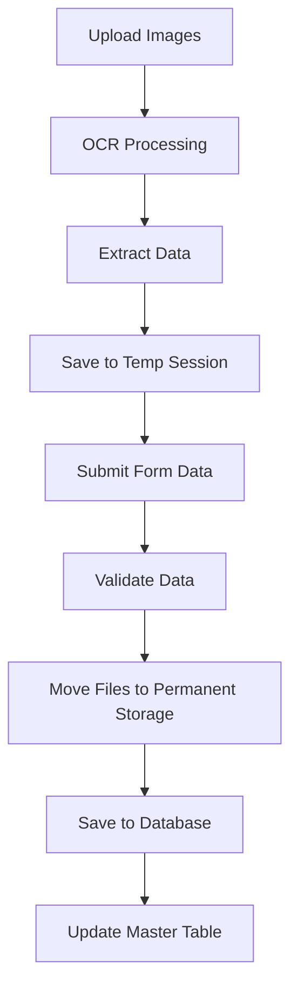
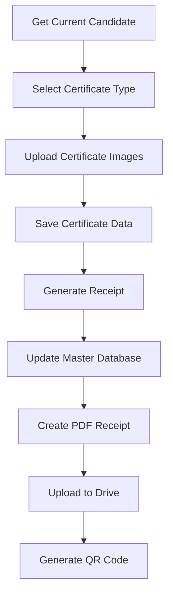
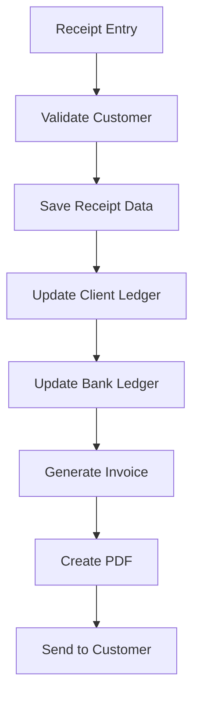

# API Documentation

## Overview

This document provides comprehensive documentation for all available API endpoints in the Document Processing Backend system. The API is built with Flask and provides endpoints for document processing, candidate management, certificate generation, bookkeeping operations, and file handling.

## Base URL

**Development:** `http://localhost:5000`

**Production:** `https://your-domain.com/api` (configure as needed)

## Authentication

Currently, the API does not require authentication for development purposes. In production, consider implementing:

- JWT token-based authentication
- API key authentication
- OAuth 2.0

## Error Handling

All endpoints return JSON responses with the following error structure:

```json
{
  "error": "Error message",
  "message": "Detailed error description",
  "status": "error"
}
```

Common HTTP status codes:
- `200` - Success
- `400` - Bad Request (validation errors)
- `404` - Not Found
- `409` - Conflict (duplicate data)
- `500` - Internal Server Error

## Environment-Specific Details

### Configuration

The API behavior can be controlled through environment variables in the `.env` file:

- `ENABLE_OCR=true/false` - Enable/disable OCR functionality
- `ENABLE_CHATGPT_FILTERING=true/false` - Enable/disable ChatGPT text filtering
- `DB_HOST`, `DB_PORT`, `DB_NAME`, `DB_USER`, `DB_PASSWORD` - Database configuration
- `OPENAI_API_KEY` - OpenAI API key for enhanced OCR

### Dependencies

Required Python packages:
- Flask
- Flask-CORS
- pytesseract
- opencv-python
- numpy
- psycopg2 (PostgreSQL)
- python-dotenv
- openai (optional)

### File Storage

- **Local Storage:** Files stored in `backend/uploads/` directory
- **Google Drive:** Optional cloud storage (requires service account configuration)
- **Database:** Images stored as BLOBs in PostgreSQL

## API Endpoints

### 1. Upload Endpoints (`/upload*`)

#### POST `/upload-images`
Upload multiple images for OCR processing and temporary storage.

**Purpose:** Handle file uploads for candidate document processing including photos, signatures, passports, and certificates.

**Functionality:**
- Validates file types (JPEG, PNG)
- Performs OCR on passport and CDC images
- Stores files temporarily in session-based folders
- Returns extracted data and session information

**Request:**
- Method: `POST`
- Content-Type: `multipart/form-data`
- Required files: `photo`, `signature`, `passport_front_img`, `passport_back_img`
- Optional files: `cdc_img`, `marksheet`

**Response:**
```json
{
  "status": "success",
  "message": "Images uploaded and stored temporarily with OCR processing",
  "data": {
    "passport_front": {
      "name": "JOHN DOE",
      "passport_no": "P1234567",
      "date_of_birth": "1990-01-01",
      "place_of_birth": "MUMBAI",
      "date_of_issue": "2020-01-01",
      "date_of_expiry": "2030-01-01",
      "place_of_issue": "MUMBAI"
    },
    "passport_back": {
      "address": "123 Main St, Mumbai",
      "emergency_contact": "+91-9876543210"
    },
    "cdc": {
      "cdc_no": "CDC123456",
      "indos_no": "IND123456"
    },
    "session_id": "uuid-string",
    "uploaded_files": {
      "photo": "photo.jpg",
      "signature": "signature.png"
    }
  },
  "session_id": "uuid-string",
  "files_processed": 4,
  "ocr_enabled": true
}
```

**Parameters:**
- `photo`: Candidate photo (max 5MB)
- `signature`: Candidate signature (max 5MB)
- `passport_front_img`: Passport front page (max 5MB)
- `passport_back_img`: Passport back page (max 5MB)
- `cdc_img`: CDC certificate (optional, max 5MB)
- `marksheet`: Academic marksheet (optional, max 5MB)

**Authentication:** None required

**Error Handling:**
- `400`: Missing required files, invalid file types, file too large
- `500`: File processing errors, OCR failures

#### POST `/upload-payment-screenshot`
Upload payment screenshot to existing session.

**Purpose:** Add payment proof to candidate session.

**Request:**
- Method: `POST`
- Content-Type: `multipart/form-data`
- Form data: `sessionId` (string), `paymentScreenshot` (file)

**Response:**
```json
{
  "status": "success",
  "message": "Payment screenshot uploaded successfully",
  "filename": "payment.jpg",
  "session_id": "uuid-string"
}
```

#### POST `/upload` (Legacy)
Legacy PDF upload endpoint.

**Purpose:** Upload PDF files to Google Drive or local storage.

**Request:**
- Method: `POST`
- Content-Type: `multipart/form-data`
- File: `pdf`

**Response:**
```json
{
  "success": true,
  "status": "success",
  "drive_link": "https://drive.google.com/file/d/...",
  "qr_image": "base64-encoded-qr-code",
  "filename": "document.pdf",
  "storage_type": "google_drive"
}
```

#### POST `/test-ocr`
Test OCR functionality with a single image.

**Purpose:** Debug and test OCR processing.

**Request:**
- Method: `POST`
- Content-Type: `multipart/form-data`
- File: `image`

**Response:**
```json
{
  "status": "success",
  "extracted_text": "Extracted text from image..."
}
```

#### POST `/test-chatgpt-ocr`
Test ChatGPT-enhanced OCR filtering.

**Purpose:** Test AI-powered text extraction and filtering.

**Request:**
```json
{
  "text": "Raw OCR text",
  "type": "passport_front"
}
```

**Response:**
```json
{
  "status": "success",
  "document_type": "passport_front",
  "extracted_data": {
    "name": "JOHN DOE",
    "passport_no": "P1234567"
  },
  "chatgpt_enabled": true
}
```

#### GET `/image/<image_id>`
Retrieve image from database by ID.

**Purpose:** Serve stored images.

**Parameters:**
- `image_id`: Integer image ID

**Response:** Image file with appropriate MIME type

### 2. Candidate Management Endpoints (`/candidate/*`)

#### POST `/candidate/save-candidate-data`
Save candidate form data and organize uploaded images.

**Purpose:** Atomically save candidate information and associated files to database.

**Functionality:**
- Validates candidate data
- Moves files from temp session to permanent storage
- Creates database records in candidates and candidate_uploads tables
- Updates master database table

**Request:**
```json
{
  "firstName": "John",
  "lastName": "Doe",
  "passport": "P1234567",
  "email": "john@example.com",
  "phone": "+91-9876543210",
  "session_id": "uuid-string",
  "ocr_data": {
    "passport_front": {...},
    "passport_back": {...}
  }
}
```

**Response:**
```json
{
  "status": "success",
  "message": "Candidate data and images saved atomically",
  "candidate_name": "John_Doe_P1234567",
  "record_id": 123,
  "files_count": 4,
  "session_id": "uuid-string"
}
```

**Validation:**
- Required: firstName, lastName, passport, session_id
- Email format validation
- Phone format validation
- Session ID format validation (UUID)

#### GET `/candidate/get-candidate-data/<filename>` (Legacy)
Retrieve candidate data by filename.

**Parameters:**
- `filename`: Candidate filename

#### GET `/candidate/get-all-candidates`
Get all candidates with their images.

**Purpose:** Retrieve complete candidate list for admin panel.

**Query Parameters:**
- `limit`: Maximum records to return (default: 1000)
- `offset`: Pagination offset (default: 0)

**Response:**
```json
{
  "status": "success",
  "data": [
    {
      "id": 123,
      "candidate_name": "John_Doe_P1234567",
      "session_id": "uuid-string",
      "candidate_data": {...},
      "ocr_data": {...},
      "files": [
        {
          "id": 456,
          "file_name": "photo.jpg",
          "file_type": "jpg",
          "mime_type": "image/jpeg",
          "file_size": 1024000,
          "image_num": 1
        }
      ],
      "created_at": "2024-01-01T10:00:00Z"
    }
  ],
  "total": 150
}
```

#### GET `/candidate/search-candidates`
Search candidates by various fields.

**Query Parameters:**
- `q`: Search term
- `field`: Search field (firstName, lastName, email, passport, candidate_name)

**Example:** `/candidate/search-candidates?q=john&field=firstName`

#### GET `/candidate/get-current-candidate-for-certificate`
Get most recently created candidate for certificate generation.

**Response:**
```json
{
  "status": "success",
  "data": {
    "firstName": "John",
    "lastName": "Doe",
    "passport": "P1234567"
  },
  "message": "Current candidate data retrieved successfully"
}
```

#### POST `/candidate/update-candidate-data`
Update existing candidate data.

**Request:**
```json
{
  "id": 123,
  "firstName": "John",
  "lastName": "Doe",
  "email": "john.doe@example.com"
}
```

#### GET `/candidate/image/<candidate_id>/<image_num>`
Get specific candidate image.

**Parameters:**
- `candidate_id`: Candidate database ID
- `image_num`: Image number (1-6)

#### GET `/candidate/get-combined-candidate-data/<candidate_name>`
Get comprehensive candidate data from all sources.

**Response:**
```json
{
  "candidate_name": "John_Doe_P1234567",
  "master_data": [...],
  "uploads": [...],
  "certificates": [...],
  "candidate_info": {...},
  "data_sources": {
    "master_table_records": 2,
    "upload_files": 4,
    "certificate_records": 1,
    "has_candidate_info": true
  }
}
```

#### GET `/candidate/get-unique-candidate-names`
Get all unique candidate names across tables.

#### GET `/candidate/download-image/<image_id>`
Download image by ID.

### 3. Certificate Endpoints (`/certificate/*`)

#### POST `/certificate/save-certificate-data`
Save certificate data with images.

**Purpose:** Store certificate information and associated images for receipt generation.

**Request:**
```json
{
  "firstName": "John",
  "lastName": "Doe",
  "passport": "P1234567",
  "clientName": "ABC Shipping",
  "certificateName": "STCW Certificate",
  "verificationImageData": "base64-encoded-image",
  "certificateImageData": "base64-encoded-image"
}
```

**Response:**
```json
{
  "status": "success",
  "message": "Certificate data saved successfully",
  "data": {
    "id": 456,
    "candidate_id": 123,
    "certificate_name": "STCW Certificate",
    "has_images": true
  }
}
```

#### GET `/certificate/get-certificate-selections-for-receipt`
Get all certificate selections for receipt processing.

**Response:**
```json
{
  "status": "success",
  "data": [
    {
      "id": 456,
      "candidate_name": "John_Doe_P1234567",
      "client_name": "ABC Shipping",
      "certificate_name": "STCW Certificate",
      "creation_date": "2024-01-01T10:00:00Z",
      "has_verification_image": true,
      "has_certificate_image": true
    }
  ],
  "total": 25
}
```

#### DELETE `/certificate/delete-certificate-selection`
Delete certificate selection by ID.

**Request:**
```json
{
  "id": 456
}
```

#### PUT `/certificate/update-certificate-selection`
Update certificate selection.

**Request:**
```json
{
  "id": 456,
  "certificate_name": "Updated Certificate Name"
}
```

#### POST `/certificate/update-certificate-company-data`
Update company data for multiple certificates.

**Request:**
```json
{
  "certificateIds": [456, 457, 458],
  "companyName": "New Company Name",
  "rateData": {...}
}
```

#### GET `/certificate/verification-image/<certificate_id>`
Serve verification image.

#### GET `/certificate/certificate-image/<certificate_id>`
Serve certificate image.

### 4. Miscellaneous Endpoints (`/`)

#### GET `/`
Health check endpoint.

**Response:**
```json
{
  "status": "success",
  "message": "Document Processing Server is running",
  "timestamp": "2024-01-01T10:00:00.000Z"
}
```

#### POST `/cleanup-expired-sessions`
Clean up temporary session folders.

**Request:**
```json
{
  "hours_old": 24
}
```

#### POST `/save-pdf`
Save generated PDF and upload to Google Drive.

**Request:**
- Method: `POST`
- Content-Type: `multipart/form-data`
- File: `pdf`

**Response:**
```json
{
  "success": true,
  "drive_link": "https://drive.google.com/file/d/...",
  "qr_image": "base64-qr-code",
  "filename": "document.pdf",
  "storage_type": "google_drive"
}
```

#### POST `/save-right-pdf`
Save PDF locally only (no Google Drive).

#### GET `/download-pdf/<filename>`
Download PDF file.

#### GET `/list-files`
List all uploaded files.

**Response:**
```json
{
  "status": "success",
  "files": {
    "images": ["image1.jpg", "image2.png"],
    "json": ["data1.json"],
    "pdfs": ["doc1.pdf"]
  }
}
```

#### GET `/get-company-accounts`
Get company account numbers.

**Response:**
```json
{
  "status": "success",
  "data": [
    {
      "id": 1,
      "company_name": "ANGEL SEAFARER DOCUMENTATION PRIVATE LIMITED",
      "account_number": "101-2103-4948",
      "bank_name": "IDFC FIRST BANK"
    }
  ]
}
```

#### GET `/get-company-details/<account_number>`
Get company details by account number.

**Response:**
```json
{
  "status": "success",
  "data": {
    "company_name": "ANGEL SEAFARER DOCUMENTATION PRIVATE LIMITED",
    "company_address": "SHOP NO-3, PUNIT TOWER-II...",
    "company_gst_number": "27AAYCA0004D1Z0",
    "bank_name": "IDFC FIRST BANK",
    "account_number": "101-2103-4948",
    "ifsc_code": "IDFB0040172"
  }
}
```

### 5. Bookkeeping Endpoints (`/api/bookkeeping/*`)

#### GET `/api/bookkeeping/get-all-companies`
Get all companies for dropdown.

#### GET `/api/bookkeeping/get-b2b-customers`
Get B2B customers for invoice generation.

**Response:**
```json
{
  "status": "success",
  "data": [
    {
      "id": 1,
      "company_name": "Tech Solutions India Pvt Ltd",
      "gst_number": "22AAAAA0000A1Z5",
      "contact_person": "Rajesh Kumar",
      "phone_number": "+91-9876543210",
      "email": "rajesh.kumar@techsolutions.com",
      "address": "123 Business Park, Sector 18",
      "city": "Gurgaon",
      "state": "Haryana",
      "state_code": "06",
      "pincode": "122001"
    }
  ],
  "total": 50
}
```

#### GET `/api/bookkeeping/get-customer-details`
Get customer details by name.

**Query Parameters:**
- `name`: Customer name to search for

#### GET `/api/bookkeeping/get-b2b-customer/<customer_id>`
Get specific B2B customer by ID.

#### GET `/api/bookkeeping/get-company-accounts`
Get company accounts.

#### GET `/api/bookkeeping/get-company-details/<account_number>`
Get company details by account number.

#### POST `/api/bookkeeping/upload-to-ledger`
Upload data to company ledger.

**Request:**
```json
{
  "company_name": "ABC Company",
  "date": "2024-01-15",
  "particulars": "Payment received",
  "voucher_no": "RCPT-001",
  "voucher_type": "Receipt",
  "debit": 0,
  "credit": 50000
}
```

#### GET `/api/bookkeeping/company-ledger`
Get company ledger with filtering and pagination.

**Query Parameters:**
- `company_name`: Company name (required)
- `start_date`: Start date filter
- `end_date`: End date filter
- `candidate_name`: Filter by candidate
- `voucher_type`: Filter by voucher type
- `limit`: Records per page (default: 50)
- `offset`: Pagination offset

**Response:**
```json
{
  "status": "success",
  "data": {
    "entries": [
      {
        "date": "2024-01-15",
        "particulars": "Payment received",
        "voucher_type": "Receipt",
        "voucher_no": "RCPT-001",
        "debit": 0,
        "credit": 50000,
        "company_name": "ABC Company"
      }
    ],
    "summary": {
      "opening_balance": 0,
      "total_debit": 25000,
      "total_credit": 50000,
      "closing_balance": 25000,
      "balance_type": "Outstanding"
    },
    "total_entries": 100,
    "pagination": {
      "limit": 50,
      "offset": 0,
      "has_more": true
    }
  }
}
```

#### DELETE `/api/bookkeeping/company-ledger/<ledger_id>`
Delete ledger entry.

#### POST `/api/bookkeeping/receipt-invoice-data`
Create receipt invoice data record.

#### POST `/api/bookkeeping/receipt-amount-received`
Create receipt amount received record.

**Request:**
```json
{
  "amount_received": 50000,
  "payment_type": "Bank Transfer",
  "transaction_date": "2024-01-15",
  "customer_name": "ABC Company",
  "transaction_id": "TXN123456"
}
```

#### GET `/api/bookkeeping/receipt-amount-received`
Get receipt records with pagination.

#### GET `/api/bookkeeping/receipt-amount-received/<receipt_id>`
Get specific receipt by ID.

#### PUT `/api/bookkeeping/receipt-amount-received/<receipt_id>`
Update receipt record.

#### DELETE `/api/bookkeeping/receipt-amount-received/<receipt_id>`
Delete receipt record.

#### GET `/api/bookkeeping/bank-ledger-report`
Get bank ledger report.

#### GET `/api/bookkeeping/vendor-ledger-report`
Get vendor ledger report.

#### GET `/api/bookkeeping/vendor-ledger/<vendor_id>`
Get unified vendor ledger.

#### POST `/api/bookkeeping/vendor-service-entry`
Create vendor service entry.

#### POST `/api/bookkeeping/vendor-payment-entry`
Create vendor payment entry.

#### POST `/api/bookkeeping/expense-payment-entry`
Create expense payment entry.

#### GET `/api/bookkeeping/expense-ledger`
Get expense ledger.

#### DELETE `/api/bookkeeping/expense-ledger/<entry_id>`
Delete expense ledger entry.

#### DELETE `/api/bookkeeping/bank-ledger/<entry_id>`
Delete bank ledger entry.

#### POST `/api/bookkeeping/adjustments`
Create adjustment entry.

#### GET `/api/bookkeeping/get-client-adjustment/<adjustment_id>`
Get client adjustment.

#### GET `/api/bookkeeping/get-vendor-adjustment/<adjustment_id>`
Get vendor adjustment.

#### GET `/api/bookkeeping/generate-invoice-number`
Generate next sequential invoice number.

**Response:**
```json
{
  "status": "success",
  "data": {
    "invoice_number": "AMA/FY-25-26/0001"
  }
}
```

#### GET `/api/bookkeeping/get-vendor-details/<vendor_id>`
Get vendor details.

## Code Examples

### JavaScript (Frontend Integration)

```javascript
// Upload images
const formData = new FormData();
formData.append('photo', photoFile);
formData.append('signature', signatureFile);
formData.append('passport_front_img', passportFrontFile);
formData.append('passport_back_img', passportBackFile);

const response = await fetch('/upload-images', {
  method: 'POST',
  body: formData
});

const result = await response.json();
console.log('Session ID:', result.session_id);
```

### Python (Backend Integration)

```python
import requests

# Save candidate data
candidate_data = {
    "firstName": "John",
    "lastName": "Doe",
    "passport": "P1234567",
    "session_id": "uuid-string"
}

response = requests.post('/candidate/save-candidate-data', json=candidate_data)
result = response.json()
print(f"Candidate saved with ID: {result['record_id']}")
```

### cURL Examples

```bash
# Health check
curl -X GET http://localhost:5000/

# Upload images
curl -X POST http://localhost:5000/upload-images \
  -F "photo=@photo.jpg" \
  -F "signature=@signature.png" \
  -F "passport_front_img=@passport_front.jpg" \
  -F "passport_back_img=@passport_back.jpg"

# Get all candidates
curl -X GET http://localhost:5000/candidate/get-all-candidates

# Save certificate data
curl -X POST http://localhost:5000/certificate/save-certificate-data \
  -H "Content-Type: application/json" \
  -d '{
    "firstName": "John",
    "lastName": "Doe",
    "passport": "P1234567",
    "certificateName": "STCW Certificate"
  }'
```

## Database Schema

### Key Tables

- **candidates**: Stores candidate personal information
- **candidate_uploads**: Stores uploaded images as BLOBs
- **certificate_selections**: Stores certificate data and images
- **Master_Database_Table_A**: Master database for consolidated data
- **ClientLedger**: Company ledger entries
- **ReceiptAmountReceived**: Payment receipt records
- **b2bcustomersdetails**: B2B customer information
- **company_details**: Company account information
- **vendors**: Vendor information
- **vendor_services**: Vendor service entries
- **vendor_payments**: Vendor payment records
- **expense_ledger**: Expense tracking
- **bank_ledger**: Bank transaction records

## Workflow Diagrams

### Candidate Processing Flow



### Certificate Generation Flow



### Bookkeeping Flow



## Security Considerations

1. **File Upload Security:**
   - File type validation
   - File size limits (5MB per image)
   - Secure filename generation
   - Temporary file cleanup

2. **Database Security:**
   - Parameterized queries to prevent SQL injection
   - Input validation and sanitization
   - Transaction management for data integrity

3. **API Security:**
   - CORS configuration for allowed origins
   - Input validation on all endpoints
   - Error message sanitization

## Performance Considerations

1. **File Handling:**
   - Temporary session-based storage
   - Automatic cleanup of expired sessions
   - Efficient file streaming for downloads

2. **Database:**
   - Connection pooling
   - Indexed queries for performance
   - Pagination for large result sets

3. **OCR Processing:**
   - Optional OCR (can be disabled)
   - Fallback to manual data entry
   - ChatGPT integration for enhanced accuracy

## Monitoring and Logging

The API includes comprehensive logging:
- File upload operations
- Database transactions
- OCR processing results
- Error conditions
- Performance metrics

Logs are written to console and can be configured for external logging services.

## Future Enhancements

1. **Authentication & Authorization**
2. **Rate Limiting**
3. **API Versioning**
4. **Webhook Support**
5. **Real-time Notifications**
6. **Advanced Search & Filtering**
7. **Bulk Operations**
8. **Audit Trail**
9. **Multi-language Support**
10. **API Documentation Auto-generation**

---

## Production Deployment Guide

This section provides a comprehensive guide for transitioning from localhost development to production deployment.

### Environment Variables and Configuration

#### Production Environment Variables (`.env.production`)

```bash
# Database Configuration
DB_HOST=your-production-db-host.rds.amazonaws.com
DB_PORT=5432
DB_NAME=your_production_db
DB_USER=your_db_user
DB_PASSWORD=your_secure_db_password
DB_SSL_MODE=require
DB_CONNECTION_TIMEOUT=30

# Security
SECRET_KEY=your-256-bit-secret-key-here
JWT_SECRET_KEY=your-jwt-secret-key-here
SESSION_SECRET=your-session-secret-key-here

# API Keys
OPENAI_API_KEY=your-openai-api-key
GOOGLE_DRIVE_SERVICE_ACCOUNT_FILE=service-account-prod.json

# Feature Flags
ENABLE_OCR=true
ENABLE_CHATGPT_FILTERING=true

# CORS
ALLOWED_ORIGINS=https://yourdomain.com,https://www.yourdomain.com

# File Storage
USE_GOOGLE_DRIVE=true
MAX_FILE_SIZE=10485760

# Logging
LOG_LEVEL=INFO
LOG_FILE=/var/log/app/app.log

# Server Configuration
HOST=0.0.0.0
PORT=8000
DEBUG=false
WORKERS=4
```

### Security Enhancements

#### Authentication Middleware

Create `backend/middleware/auth.py`:

```python
from flask import request, jsonify, g
from functools import wraps
import jwt
import os
from datetime import datetime, timedelta

def token_required(f):
    @wraps(f)
    def decorated(*args, **kwargs):
        token = None

        if 'Authorization' in request.headers:
            auth_header = request.headers['Authorization']
            if auth_header.startswith('Bearer '):
                token = auth_header.split(' ')[1]

        if not token and 'access_token' in request.cookies:
            token = request.cookies.get('access_token')

        if not token:
            return jsonify({'error': 'Token is missing'}), 401

        try:
            payload = jwt.decode(token, os.getenv('JWT_SECRET_KEY'), algorithms=['HS256'])
            g.user_id = payload['user_id']
            g.user_role = payload.get('role', 'user')
        except jwt.ExpiredSignatureError:
            return jsonify({'error': 'Token has expired'}), 401
        except jwt.InvalidTokenError:
            return jsonify({'error': 'Token is invalid'}), 401

        return f(*args, **kwargs)
    return decorated

def admin_required(f):
    @wraps(f)
    def decorated(*args, **kwargs):
        if g.user_role != 'admin':
            return jsonify({'error': 'Admin access required'}), 403
        return f(*args, **kwargs)
    return decorated
```

#### Rate Limiting

Create `backend/middleware/rate_limit.py`:

```python
from flask import request
from functools import wraps
import time
from collections import defaultdict

rate_limits = defaultdict(list)

def rate_limit(max_requests=100, window_seconds=60):
    def decorator(f):
        @wraps(f)
        def decorated(*args, **kwargs):
            client_ip = request.remote_addr
            current_time = time.time()

            rate_limits[client_ip] = [
                req_time for req_time in rate_limits[client_ip]
                if current_time - req_time < window_seconds
            ]

            if len(rate_limits[client_ip]) >= max_requests:
                return jsonify({'error': 'Rate limit exceeded'}), 429

            rate_limits[client_ip].append(current_time)
            return f(*args, **kwargs)
        return decorated
    return decorator
```

### Database Configuration for Production

Update `backend/database/db_connection.py`:

```python
import psycopg2
import psycopg2.extras
import os
from contextlib import contextmanager
from config import Config

class DatabaseConnection:
    _pool = None

    @classmethod
    def get_pool(cls):
        if cls._pool is None:
            try:
                cls._pool = psycopg2.pool.SimpleConnectionPool(
                    minconn=1,
                    maxconn=20,  # Increased for production
                    host=Config.DB_HOST,
                    port=Config.DB_PORT,
                    database=Config.DB_NAME,
                    user=Config.DB_USER,
                    password=Config.DB_PASSWORD,
                    sslmode=Config.DB_SSL_MODE,
                    connect_timeout=Config.DB_CONNECTION_TIMEOUT
                )
                print(f"[DB] Connection pool created successfully (max: 20 connections)")
            except Exception as e:
                print(f"[DB] Failed to create connection pool: {e}")
                raise
        return cls._pool

    @classmethod
    @contextmanager
    def get_connection(cls):
        pool = cls.get_pool()
        conn = None
        try:
            conn = pool.getconn()
            conn.autocommit = False
            yield conn
        except Exception as e:
            if conn:
                conn.rollback()
            raise
        finally:
            if conn:
                pool.putconn(conn)
```

### CORS and Networking

Update `backend/app.py` for production CORS:

```python
from flask import Flask
from flask_cors import CORS
from config import Config

app = Flask(__name__)

CORS(app,
     origins=Config.ALLOWED_ORIGINS,
     methods=["GET", "POST", "PUT", "DELETE", "OPTIONS"],
     allow_headers=["Content-Type", "Authorization", "Accept", "X-Requested-With", "X-API-Key"],
     supports_credentials=True,
     max_age=86400  # 24 hours
)
```

### Logging and Monitoring

Create `backend/utils/logger.py`:

```python
import logging
import os
from logging.handlers import RotatingFileHandler
from config import Config

def setup_logging():
    log_dir = os.path.dirname(Config.LOG_FILE)
    os.makedirs(log_dir, exist_ok=True)

    logger = logging.getLogger()
    logger.setLevel(getattr(logging, Config.LOG_LEVEL.upper()))

    file_formatter = logging.Formatter(
        '%(asctime)s - %(name)s - %(levelname)s - %(message)s'
    )

    file_handler = RotatingFileHandler(
        Config.LOG_FILE,
        maxBytes=10*1024*1024,  # 10MB
        backupCount=5
    )
    file_handler.setFormatter(file_formatter)
    file_handler.setLevel(logging.INFO)

    console_handler = logging.StreamHandler()
    console_handler.setFormatter(logging.Formatter('%(levelname)s - %(message)s'))
    console_handler.setLevel(logging.DEBUG)

    logger.addHandler(file_handler)
    logger.addHandler(console_handler)

    return logger
```

### Enhanced Error Handling

Add to `backend/app.py`:

```python
from werkzeug.exceptions import HTTPException

@app.errorhandler(400)
def bad_request(error):
    logger.warning(f'400 Bad Request: {error}')
    return jsonify({
        'error': 'Bad Request',
        'message': str(error),
        'status': 'error'
    }), 400

@app.errorhandler(401)
def unauthorized(error):
    logger.warning(f'401 Unauthorized: {error}')
    return jsonify({
        'error': 'Unauthorized',
        'message': 'Authentication required',
        'status': 'error'
    }), 401

@app.errorhandler(403)
def forbidden(error):
    logger.warning(f'403 Forbidden: {error}')
    return jsonify({
        'error': 'Forbidden',
        'message': 'Access denied',
        'status': 'error'
    }), 403

@app.errorhandler(413)
def too_large(error):
    logger.warning(f'413 Request Entity Too Large: {error}')
    return jsonify({
        'error': 'File Too Large',
        'message': 'The uploaded file exceeds the maximum allowed size',
        'status': 'error'
    }), 413

@app.errorhandler(429)
def rate_limit_exceeded(error):
    logger.warning(f'429 Rate Limit Exceeded: {request.remote_addr}')
    return jsonify({
        'error': 'Rate Limit Exceeded',
        'message': 'Too many requests. Please try again later.',
        'status': 'error'
    }), 429

@app.errorhandler(500)
def internal_error(error):
    logger.error(f'500 Internal Server Error: {error}', exc_info=True)
    return jsonify({
        'error': 'Internal Server Error',
        'message': 'An unexpected error occurred. Please try again later.',
        'status': 'error'
    }), 500
```

### Deployment Options

#### Docker Deployment

**Dockerfile**:
```dockerfile
FROM python:3.9-slim

RUN apt-get update && apt-get install -y \
    tesseract-ocr \
    tesseract-ocr-eng \
    libgl1-mesa-glx \
    libglib2.0-0 \
    libsm6 \
    libxext6 \
    libxrender-dev \
    libgomp1 \
    && rm -rf /var/lib/apt/lists/*

WORKDIR /app

COPY backend/requirements.txt .
RUN pip install --no-cache-dir -r requirements.txt

COPY backend/ .

RUN useradd --create-home --shell /bin/bash app \
    && chown -R app:app /app
USER app

EXPOSE 8000

HEALTHCHECK --interval=30s --timeout=10s --start-period=5s --retries=3 \
    CMD curl -f http://localhost:8000/ || exit 1

CMD ["gunicorn", "--bind", "0.0.0.0:8000", "--workers", "4", "app:app"]
```

#### Heroku Deployment

**Procfile**:
```
web: gunicorn --bind 0.0.0.0:$PORT --workers 1 app:app
```

### Key Production Changes by File

#### `backend/config.py`
- Add production environment variable loading
- Configure security keys, CORS origins, logging
- Set production database and file storage settings

#### `backend/routes/__init__.py`
- Apply authentication decorators to sensitive blueprints
- Add rate limiting to upload endpoints

#### `backend/app.py`
- Production CORS configuration
- Enhanced error handlers
- Logging setup
- SSL enforcement (optional)

#### All Route Files
- Add `@token_required` decorators to sensitive endpoints
- Add `@admin_required` for admin-only operations
- Apply rate limiting to upload endpoints

### Pre-deployment Checklist

1. ✅ Environment variables configured for production
2. ✅ Database connection tested with SSL
3. ✅ Authentication middleware implemented
4. ✅ Rate limiting applied to upload endpoints
5. ✅ CORS configured for production domains
6. ✅ Enhanced logging and error handling
7. ✅ File storage (Google Drive/S3) configured
8. ✅ SSL certificates obtained and configured
9. ✅ Database backups and monitoring set up
10. ✅ Health checks and alerts configured

### Security Considerations for Production

1. **Authentication**: JWT-based authentication for all sensitive endpoints
2. **Rate Limiting**: Prevent abuse with request rate limits
3. **CORS**: Restrict origins to your production domain
4. **HTTPS**: Enforce SSL/TLS for all connections
5. **Input Validation**: Sanitize all user inputs
6. **File Upload Security**: Validate file types and sizes
7. **Database Security**: Use parameterized queries, connection pooling
8. **Logging**: Comprehensive logging for monitoring and debugging
9. **Backups**: Regular database and file backups
10. **Monitoring**: Health checks and performance monitoring

---

*Last Updated: October 2024*
*API Version: 1.0*
*Environment: Development/Production*