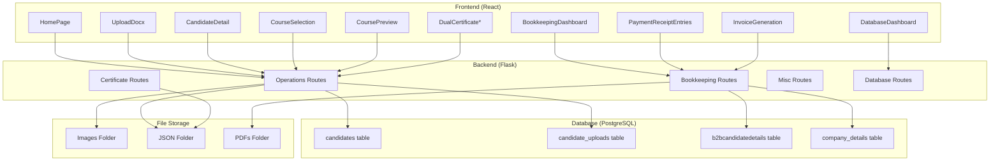
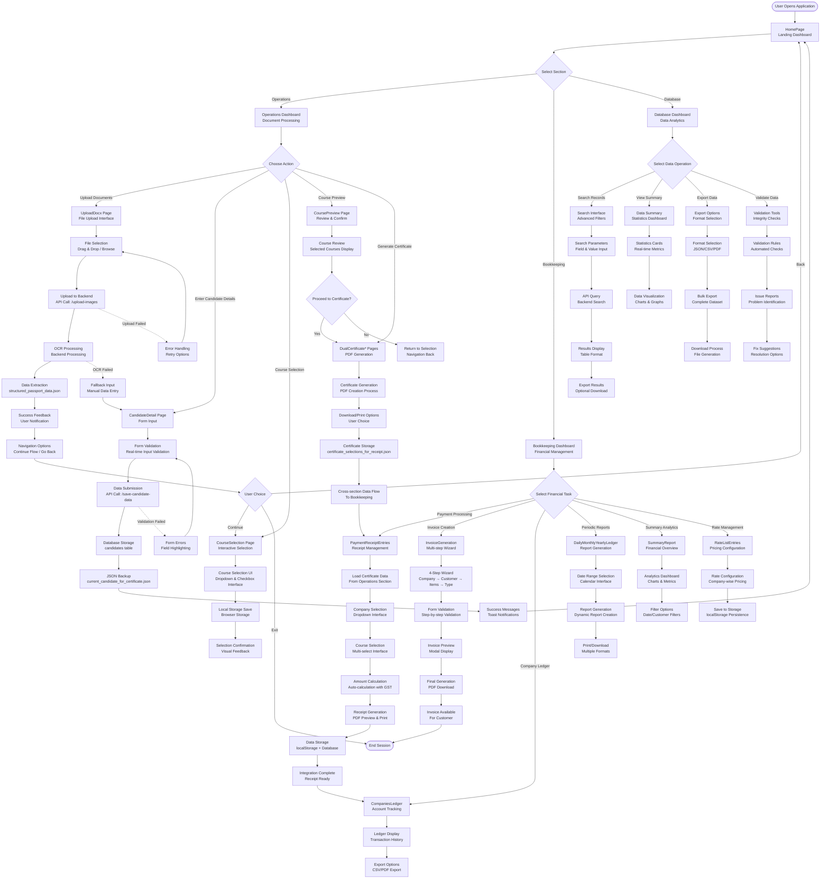
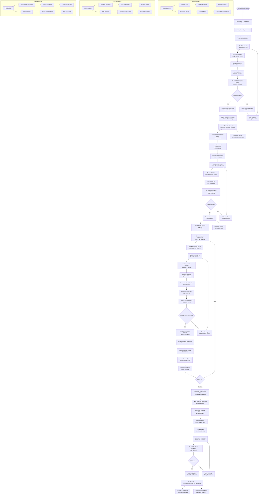
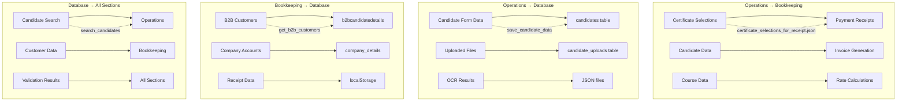

# Maritime Certificate System - Project Flow & Architecture

## Overview
This document provides a comprehensive flowchart of the Maritime Certificate System, detailing the flow between Operations, Bookkeeping, and Database sections, along with their interconnectivity and data dependencies.

## System Architecture



## Frontend User Experience Flow

### Complete User Journey Flowchart



### Frontend Component Interaction Flow

```mermaid
flowchart TD
    subgraph "React Router Navigation"
        R1[BrowserRouter] --> R2[Routes Configuration]
        R2 --> R3[Route Matching]
        R3 --> R4[Component Rendering]
    end

    subgraph "State Management"
        S1[useState Hooks] --> S2[Local Component State]
        S1 --> S3[useReducer for Complex State]
        S2 --> S4[Real-time UI Updates]
        S3 --> S5[Wizard Flow Management]
    end

    subgraph "API Integration"
        A1[fetch() API Calls] --> A2[Backend Endpoints]
        A2 --> A3[JSON Response Handling]
        A3 --> A4[State Updates]
        A4 --> A5[UI Re-rendering]
    end

    subgraph "User Interaction"
        U1[Button Clicks] --> U2[Event Handlers]
        U2 --> U3[State Changes]
        U3 --> U4[Visual Feedback]
        U1 --> U5[Form Submissions]
        U5 --> U6[Validation Logic]
        U6 --> U7[API Calls / Navigation]
    end

    subgraph "Data Persistence"
        P1[localStorage] --> P2[Form Data Persistence]
        P1 --> P3[User Preferences]
        P2 --> P4[Wizard State Recovery]
        P3 --> P5[UI Customization]
    end

    subgraph "Animation & UX"
        X1[Framer Motion] --> X2[Page Transitions]
        X1 --> X3[Hover Effects]
        X1 --> X4[Loading States]
        X2 --> X5[Smooth Navigation]
        X3 --> X6[Interactive Feedback]
        X4 --> X7[User Engagement]
    end

    R4 --> S4
    S4 --> A1
    A4 --> U4
    U7 --> R1
    P4 --> S5
    X5 --> U4
```

## Detailed Flow Diagrams

### 1. Operations Section Frontend Flow



### 2. Bookkeeping Section Frontend Flow

```mermaid
flowchart TD
    Start([User Starts Bookkeeping]) --> A[HomePage → Bookkeeping Button]
    A --> B[Navigation to /bookkeeping]
    B --> C[BookkeepingDashboard Component<br/>6-Button Grid Interface]

    C --> D{User Selects Function}
    D -->|Payment Receipt| E[Navigation to /bookkeeping/payment-receipt]
    D -->|Invoice Generation| F[Navigation to /bookkeeping/invoice-generation]
    D -->|Companies Ledger| G[Navigation to /bookkeeping/companies-ledger]
    D -->|Periodic Ledger| H[Navigation to /bookkeeping/ledger]
    D -->|Summary Report| I[Navigation to /bookkeeping/summary-report]
    D -->|Rate Lists| J[Navigation to /bookkeeping/ratelist-entries]

    %% Payment Receipt Flow
    E --> K[PaymentReceiptEntries Component<br/>Payment Management Interface]
    K --> L[Load Certificate Data<br/>API: /get-certificate-selections-for-receipt]
    L --> M[Loading Animation<br/>Skeleton Cards]
    M --> N{Data Loaded?}

    N -->|Yes| O[Certificate List Display<br/>Table Format]
    N -->|No| P[Empty State<br/>No certificates message]

    O --> Q[Create Receipt Button<br/>Modal Trigger]
    Q --> R[Receipt Modal Open<br/>Form Interface]
    R --> S[Company Selection<br/>Dropdown from API data]
    S --> T[Date Input<br/>Calendar Picker]
    T --> U[Course Selection<br/>Multi-checkbox Interface]

    U --> V[Amount Auto-calculation<br/>Rate List Integration]
    V --> W[GST Toggle<br/>18% Calculation]
    W --> X[Discount Input<br/>Percentage/Amount]
    X --> Y[Final Amount Display<br/>Real-time Update]

    Y --> Z[Payment Type Selection<br/>Cash/NEFT/GPay]
    Z --> AA[Additional Fields<br/>Invoice No, Delivery Note, etc.]
    AA --> BB[Generate Invoice Button<br/>Preview Modal]

    BB --> CC[Invoice Preview Modal<br/>PDF-like Display]
    CC --> DD{User Action}
    DD -->|Print/Save| EE[Print Dialog<br/>Browser Print API]
    DD -->|Delete| FF[Modal Close<br/>No Action]
    DD -->|Save Receipt| GG[Receipt Submission<br/>API Call]

    GG --> HH[API: /update-certificate-company-data<br/>Update certificate records]
    HH --> II[localStorage Save<br/>Receipt data persistence]
    II --> JJ[Success Toast<br/>Green Notification]
    JJ --> KK[Navigation to /bookkeeping/companies-ledger<br/>Auto-redirect]

    P --> LL[Back to Dashboard<br/>Navigation Button]

    %% Invoice Generation Flow
    F --> MM[InvoiceGeneration Component<br/>4-Step Wizard]
    MM --> NN[Step 1: Company Details<br/>Company Account Selection]
    NN --> OO[API: /get-company-accounts<br/>Load company data]
    OO --> PP[Auto-fill Form<br/>Company details population]
    PP --> QQ[Next Button<br/>Step Validation]

    QQ --> RR[Step 2: Customer Details<br/>B2B/B2C Toggle]
    RR --> SS{B2B or B2C?}
    SS -->|B2B| TT[B2B Customer Selection<br/>API: /get-b2b-customers]
    SS -->|B2C| UU[B2C Manual Input<br/>Name, Address, Contact]

    TT --> VV[Customer Auto-fill<br/>API: /get-b2b-customer/{id}]
    VV --> WW[B2B Form Population<br/>GST, Address, Phone]
    UU --> XX[B2C Form Input<br/>Manual entry fields]

    WW --> YY[Next Button<br/>Customer Validation]
    XX --> YY

    YY --> ZZ[Step 3: Particular Info<br/>Invoice Items Management]
    ZZ --> AAA[Add Customer Button<br/>Dynamic Form Creation]
    AAA --> BBB[Customer Name Input<br/>Item List Creation]
    BBB --> CCC[Add Item Button<br/>Dynamic Item Fields]
    CCC --> DDD[Item Description Input<br/>Quantity, Rate, Amount]

    DDD --> EEE[Remove Options<br/>Delete Customer/Item]
    EEE --> FFF[Real-time Total Calculation<br/>Auto-sum amounts]

    FFF --> GGG[Next Button<br/>Items Validation]
    GGG --> HHH[Step 4: Invoice Type<br/>GST/Proforma Selection]
    HHH --> III[Preview Options<br/>Modal Preview]
    III --> JJJ[Generate Button<br/>Final Processing]

    JJJ --> KKK[Invoice Data Compilation<br/>JSON Structure Creation]
    KKK --> LLL[Navigation to Tax Invoice<br/>/bookkeeping/tax-invoice]
    LLL --> MMM[ProformaGstInvoice Component<br/>PDF Generation Interface]

    MMM --> NNN[Invoice Template Rendering<br/>Professional Layout]
    NNN --> OOO[Print/Save Options<br/>Browser Print API]
    OOO --> PPP[Invoice Saved<br/>Success Confirmation]

    %% Companies Ledger Flow
    G --> QQQ[CompaniesLedger Component<br/>Account Management]
    QQQ --> RRR[Load Receipt Data<br/>From localStorage]
    RRR --> SSS[Transaction Display<br/>Table Format]
    SSS --> TTT[Export Options<br/>CSV/PDF Download]

    %% Periodic Ledger Flow
    H --> UUU[DailyMonthlyYearlyLedger Component<br/>Report Generation]
    UUU --> VVV[Date Range Selection<br/>Calendar Interface]
    VVV --> WWW[Report Type Selection<br/>Daily/Monthly/Yearly]
    WWW --> XXX[Generate Report Button<br/>Processing Animation]
    XXX --> YYY[Report Display<br/>Dynamic Table/Charts]
    YYY --> ZZZ[Export Options<br/>Multiple Formats]

    %% Summary Report Flow
    I --> AAAA[SummaryReport Component<br/>Analytics Dashboard]
    AAAA --> BBBB[Load All Data<br/>Receipts, Invoices, Rates]
    BBBB --> CCCC[Calculate Metrics<br/>Totals, Averages, Trends]
    CCCC --> DDDD[Chart Generation<br/>Visual Analytics]
    DDDD --> EEEE[Filter Options<br/>Date/Customer Filters]

    %% Rate Lists Flow
    J --> FFFF[RateListEntries Component<br/>Pricing Management]
    FFFF --> GGGG[Company Selection<br/>Dropdown Interface]
    GGGG --> HHHH[Course Rate Input<br/>Dynamic Form Fields]
    HHHH --> IIII[Save to localStorage<br/>Rate persistence]
    IIII --> JJJJ[Success Feedback<br/>Toast Notification]

    %% User Experience Features
    subgraph "Bookkeeping UX Features"
        UX1[Modal Interfaces] --> UX2[Form Wizards]
        UX1 --> UX3[Progress Indicators]
        UX2 --> UX4[Step Validation]
        UX3 --> UX5[Loading States]
        UX4 --> UX6[Error Handling]
        UX5 --> UX7[Success Animations]
    end

    subgraph "Data Integration"
        DI1[API Calls] --> DI2[Real-time Updates]
        DI1 --> DI3[Error Recovery]
        DI2 --> DI4[State Management]
        DI3 --> DI5[Fallback Data]
        DI4 --> DI6[UI Synchronization]
        DI5 --> DI7[Offline Mode]
    end

    subgraph "Financial Calculations"
        FC1[Auto-calculation] --> FC2[GST Application]
        FC1 --> FC3[Discount Handling]
        FC2 --> FC4[Tax Compliance]
        FC3 --> FC5[Final Amount Display]
        FC4 --> FC6[Invoice Accuracy]
        FC5 --> FC7[Receipt Validation]
    end

    %% Error Handling
    OO -.->|API Failed| Error1[Mock Data Fallback<br/>Offline Mode]
    VV -.->|Load Failed| Error2[Manual Input<br/>Alternative Flow]
    HH -.->|Update Failed| Error3[Retry Mechanism<br/>Error Recovery]

    Error1 --> PP
    Error2 --> WW
    Error3 --> GG
```

### 3. Database Section Frontend Flow

```mermaid
flowchart TD
    Start([User Starts Database]) --> A[HomePage → Database Button]
    A --> B[Navigation to /database]
    B --> C[DatabaseDashboard Component<br/>Feature Grid Interface]

    C --> D{Select Database Operation}
    D -->|Search Candidates| E[Search Interface<br/>Advanced Filters]
    D -->|Data Summary| F[Summary Dashboard<br/>Statistics Overview]
    D -->|Export Data| G[Export Tools<br/>Format Selection]
    D -->|Validate Data| H[Validation Suite<br/>Integrity Checks]

    %% Search Candidates Flow
    E --> I[SearchCandidates Component<br/>Advanced Search Interface]
    I --> J[Search Field Selection<br/>Name, Passport, Email, etc.]
    J --> K[Search Value Input<br/>Text Input Field]
    K --> L[Search Button Click<br/>API Call Trigger]

    L --> M[Loading Animation<br/>Search Progress Indicator]
    M --> N[API Call: GET /search-candidates<br/>Query Parameters]
    N --> O{Search Results?}

    O -->|Found| P[Results Table Display<br/>Candidate Records]
    O -->|None| Q[No Results Message<br/>Empty State]

    P --> R[Result Details View<br/>Expandable Rows]
    R --> S[File Information Display<br/>Upload History]
    S --> T[Export Results Option<br/>CSV/PDF Download]

    Q --> U[Modify Search Criteria<br/>Back to Search Form]
    U --> J

    T --> V[Export Processing<br/>File Generation]
    V --> W[Download Dialog<br/>Save File Prompt]

    %% Data Summary Flow
    F --> X[DataSummary Component<br/>Analytics Dashboard]
    X --> Y[API Call: GET /data-summary<br/>Statistics Request]
    Y --> Z[Loading State<br/>Skeleton Cards]

    Z --> AA[Statistics Display<br/>Metric Cards]
    AA --> BB[Candidates Count<br/>Upload Statistics]
    BB --> CC[File Type Breakdown<br/>Chart Visualization]
    CC --> DD[Last Updated Info<br/>Timestamp Display]

    DD --> EE[Data Sources List<br/>JSON/DB Tables]
    EE --> FF[Refresh Button<br/>Real-time Update]

    FF --> Y

    %% Export Data Flow
    G --> GG[ExportData Component<br/>Export Configuration]
    GG --> HH[Export Format Selection<br/>JSON/CSV/PDF Options]
    HH --> II[Data Range Selection<br/>Date Filters]
    II --> JJ[Include Options<br/>File Types Selection]

    JJ --> KK[Export Button Click<br/>Processing Start]
    KK --> LL[Progress Bar<br/>Export Progress]
    LL --> MM[API Call: GET /export-data<br/>Bulk Data Request]

    MM --> NN{Export Success?}
    NN -->|Yes| OO[File Download<br/>Browser Download API]
    NN -->|No| PP[Error Message<br/>Retry Option]

    OO --> QQ[Success Confirmation<br/>Export Complete]
    PP --> KK

    %% Validate Data Flow
    H --> RR[DataValidation Component<br/>Integrity Checker]
    RR --> SS[Validation Type Selection<br/>Quick/Full Scan]
    SS --> TT[Start Validation Button<br/>Process Trigger]

    TT --> UU[Validation Progress<br/>Step-by-step Processing]
    UU --> VV[API Call: GET /data-validation<br/>Integrity Check]

    VV --> WW{Validation Results}
    WW -->|Passed| XX[Success Display<br/>Green Checkmarks]
    WW -->|Issues Found| YY[Issues List<br/>Problem Details]

    XX --> ZZ[Validation Report<br/>Clean Bill of Health]
    YY --> AAA[Issue Categories<br/>Errors/Warnings]
    AAA --> BBB[Fix Suggestions<br/>Resolution Options]
    BBB --> CCC[Re-run Validation<br/>After Fixes]

    CCC --> TT

    %% Database Tables Integration
    subgraph "PostgreSQL Tables"
        DB1[candidates<br/>Consolidated candidate data]
        DB2[candidate_uploads<br/>File upload records]
        DB3[b2bcandidatedetails<br/>B2B customer data]
        DB4[company_details<br/>Company account data]
    end

    %% File Storage Integration
    subgraph "File Storage"
        FS1[Images Folder<br/>Uploaded images]
        FS2[JSON Folder<br/>Structured data]
        FS3[PDFs Folder<br/>Generated PDFs]
    end

    %% API Integration Points
    N --> DB1
    N --> DB2
    Y --> DB1
    Y --> DB2
    Y --> DB3
    Y --> DB4
    MM --> FS1
    MM --> FS2
    MM --> FS3
    VV --> FS1
    VV --> FS2
    VV --> FS3

    %% User Experience Features
    subgraph "Database UX Features"
        UX1[Advanced Search] --> UX2[Filter Options]
        UX1 --> UX3[Real-time Results]
        UX2 --> UX4[Saved Searches]
        UX3 --> UX5[Pagination]
        UX4 --> UX6[Export Capabilities]
        UX5 --> UX7[Bulk Operations]
    end

    subgraph "Data Visualization"
        DV1[Statistics Cards] --> DV2[Progress Charts]
        DV1 --> DV3[Metric Displays]
        DV2 --> DV4[Interactive Graphs]
        DV3 --> DV5[Trend Analysis]
        DV4 --> DV6[Data Export]
        DV5 --> DV7[Report Generation]
    end

    subgraph "Error Handling"
        EH1[API Failures] --> EH2[Fallback Messages]
        EH1 --> EH3[Retry Mechanisms]
        EH2 --> EH4[Offline Mode]
        EH3 --> EH5[Error Logging]
        EH4 --> EH6[Data Recovery]
        EH5 --> EH7[User Notifications]
    end

    %% Navigation & State Management
    subgraph "Navigation Flow"
        NAV1[React Router] --> NAV2[URL Parameters]
        NAV1 --> NAV3[Browser History]
        NAV2 --> NAV4[Deep Linking]
        NAV3 --> NAV5[Back/Forward]
        NAV4 --> NAV6[Bookmarkable URLs]
        NAV5 --> NAV7[State Persistence]
    end

    subgraph "State Management"
        SM1[useState] --> SM2[Component State]
        SM1 --> SM3[useEffect]
        SM2 --> SM4[Real-time Updates]
        SM3 --> SM5[Data Fetching]
        SM4 --> SM6[UI Synchronization]
        SM5 --> SM7[Loading States]
    end

    %% Performance Features
    subgraph "Performance Optimization"
        PERF1[Lazy Loading] --> PERF2[Code Splitting]
        PERF1 --> PERF3[Virtual Scrolling]
        PERF2 --> PERF4[Bundle Optimization]
        PERF3 --> PERF5[Memory Management]
        PERF4 --> PERF6[Caching Strategies]
        PERF5 --> PERF7[Progressive Loading]
    end

    %% Development Status
    subgraph "Current Status"
        DEV1[Under Development] --> DEV2[Coming Soon Features]
        DEV1 --> DEV3[Mock Data Fallback]
        DEV2 --> DEV4[Feature Roadmap]
        DEV3 --> DEV5[Development Mode]
        DEV4 --> DEV6[User Feedback]
        DEV5 --> DEV7[Testing Environment]
    end

    %% Data Flow Connections
    P -.->|Search Results| UX1
    AA -.->|Statistics| DV1
    OO -.->|Export Files| UX6
    ZZ -.->|Validation Status| UX7
    XX -.->|Success States| EH7
    YY -.->|Error States| EH1
```



## Inter-Section Data Flow



## API Endpoints Summary

### Operations APIs
- `POST /upload-images` - Upload and process documents
- `POST /save-candidate-data` - Save candidate information
- `GET /get-current-candidate-for-certificate` - Get candidate for certificate generation
- `POST /save-certificate-data` - Save certificate selections

### Bookkeeping APIs
- `GET /get-b2b-customers` - Get B2B customer list
- `GET /get-company-accounts` - Get company account details
- `POST /update-certificate-company-data` - Update certificate with company info

### Database APIs
- `GET /search-candidates` - Search candidates by criteria
- `GET /data-summary` - Get system data summary
- `GET /export-data` - Export all data
- `GET /data-validation` - Validate data integrity

## Data Storage Structure

### JSON Files (Config.JSON_FOLDER)
- `current_candidate_for_certificate.json` - Current candidate data
- `structured_passport_data.json` - OCR extracted data
- `certificate_selections_for_receipt.json` - Certificate selections for billing

### Database Tables
- **candidates**: Consolidated candidate information
- **candidate_uploads**: Individual file upload records
- **b2bcandidatedetails**: B2B customer information
- **company_details**: Company account information

### File Organization
```
uploads/
├── images/
│   └── [CandidateName]_[Passport]/
│       ├── photo.jpg
│       ├── signature.jpg
│       ├── passport_front.jpg
│       └── passport_back.jpg
├── json/
│   ├── current_candidate_for_certificate.json
│   ├── structured_passport_data.json
│   └── certificate_selections_for_receipt.json
└── pdfs/
    └── [Generated PDFs]
```

## Key Integration Points

1. **Certificate to Receipt Flow**: Operations generates certificates → Bookkeeping processes payments
2. **Candidate Data Sync**: Operations saves to both JSON and database for redundancy
3. **Rate List Integration**: Bookkeeping uses rate data for amount calculations
4. **Customer Data Sharing**: Database provides customer data to bookkeeping operations
5. **File Management**: Centralized file storage with database tracking

## Error Handling & Fallbacks

- Database failures → Fallback to JSON file storage
- API failures → Mock data for development
- File upload failures → Partial success with error logging
- OCR failures → Manual data entry option

## Performance Considerations

- Connection pooling for database operations
- File caching for frequently accessed documents
- Lazy loading for large datasets
- Background processing for OCR operations

---

*Note: DualCertificate refers to certificate generation pages (DualCertificate, DualCertificate2, DualCertificate3, DualCertificate4)*